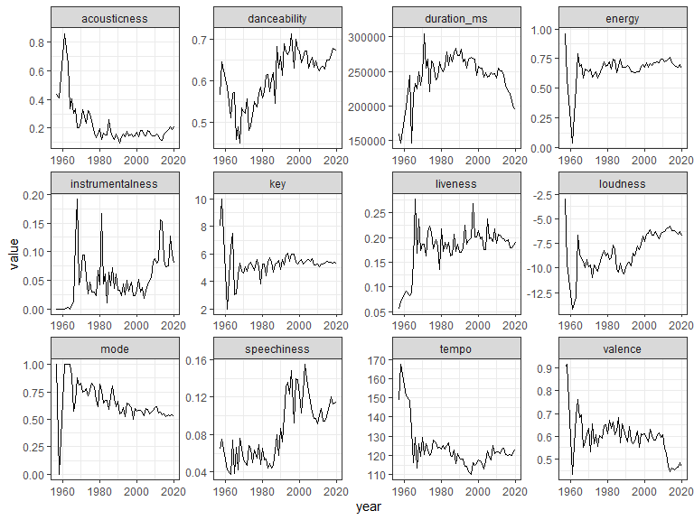
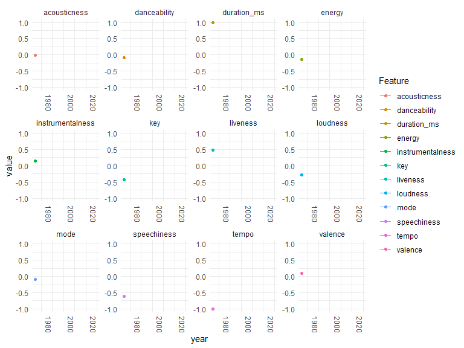
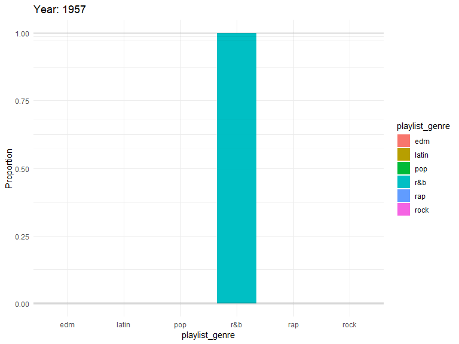

One of the RBar organizers at Memorial Univeristy of Newfoundland
introduced me to Tidy Tuesdays a few months ago but I had yet to really
attempt to dig into a dataset until I saw one with Spotify data… off
course I had to give it a go! I know I’m way behind on working on this
but it’s more about getting the practice in general than it is keeping
to the weekly schedule for me. I read through Kaylin Pavlik’s [blog
post](https://www.kaylinpavlik.com/classifying-songs-genres/) detailing
her analysis of the dataset, also linked in the TidyTuesday repository
(repo)
[here](https://github.com/rfordatascience/tidytuesday/tree/master/data/2020/2020-01-21).

Though I have been going through some of her code learning some cool
tricks, I wanted to go about this dataset looking at trends over time,
giving me a good opportunity to practice using the `gganimate` package.
And after some playing around and coming up with something moderately
pleasant to look at, I also thought it would be a good chance for me to
practice using `rmarkdown` and actually publish my work and findings on
my blog. Here goes!

### Importing the data

To import that data, I simply followed the instructions provided on the
TidyTuesday repo, the simplest one being calling the data directly from
it. I had used the `tidytuesday` package before, but this time had
issues and took the easy way out by just using another method. Maybe one
day I’ll fix the `tidytuesday` issue - but that day is not today!

This dataset include release date, but since I care about year, I
created a new variable with year alone.

    library(tidyverse)
    library(lubridate)
    library(gganimate)
    theme_set(theme_minimal())
    options(scipen = 999)

    knitr::opts_chunk$set(echo = TRUE, fig.width = 8, fig.height = 6, 
                          warning = FALSE, error = FALSE, message = FALSE)

    # Import data
    spotify_songs <- readr::read_csv('https://raw.githubusercontent.com/rfordatascience/tidytuesday/master/data/2020/2020-01-21/spotify_songs.csv')

    feature_names <- names(spotify_songs)[12:23]

    glimpse(spotify_songs,width = 60)

    ## Observations: 32,833
    ## Variables: 23
    ## $ track_id                 <chr> "6f807x0ima9a1j3VPbc7V...
    ## $ track_name               <chr> "I Don't Care (with Ju...
    ## $ track_artist             <chr> "Ed Sheeran", "Maroon ...
    ## $ track_popularity         <dbl> 66, 67, 70, 60, 69, 67...
    ## $ track_album_id           <chr> "2oCs0DGTsRO98Gh5ZSl2C...
    ## $ track_album_name         <chr> "I Don't Care (with Ju...
    ## $ track_album_release_date <chr> "2019-06-14", "2019-12...
    ## $ playlist_name            <chr> "Pop Remix", "Pop Remi...
    ## $ playlist_id              <chr> "37i9dQZF1DXcZDD7cfEKh...
    ## $ playlist_genre           <chr> "pop", "pop", "pop", "...
    ## $ playlist_subgenre        <chr> "dance pop", "dance po...
    ## $ danceability             <dbl> 0.748, 0.726, 0.675, 0...
    ## $ energy                   <dbl> 0.916, 0.815, 0.931, 0...
    ## $ key                      <dbl> 6, 11, 1, 7, 1, 8, 5, ...
    ## $ loudness                 <dbl> -2.634, -4.969, -3.432...
    ## $ mode                     <dbl> 1, 1, 0, 1, 1, 1, 0, 0...
    ## $ speechiness              <dbl> 0.0583, 0.0373, 0.0742...
    ## $ acousticness             <dbl> 0.10200, 0.07240, 0.07...
    ## $ instrumentalness         <dbl> 0.00000000, 0.00421000...
    ## $ liveness                 <dbl> 0.0653, 0.3570, 0.1100...
    ## $ valence                  <dbl> 0.518, 0.693, 0.613, 0...
    ## $ tempo                    <dbl> 122.036, 99.972, 124.0...
    ## $ duration_ms              <dbl> 194754, 162600, 176616...

    #Create new variable with year alone
    spotify_songs$year <- year(ymd(spotify_songs$track_album_release_date))

### Feature change over time

The first question I asked myself is how features might change over
time, ranging from the 60s to 2020. There’s a general feeling of less
diversity in music now and there were certainly marked changes in the
music on Billboard 100 charts as a result of the British Invasion in the
60s (but propelled by the US), the rise of disco in the 80s and rap in
the 90s. This is a simplification of results presented by Mauch,
MacCallum, Levy & Leroi in 2015 in
[this](https://royalsocietypublishing.org/doi/pdf/10.1098/rsos.150081)
paper. It occurs to me now that I’ve looked at the paper to check that I
got those revolutions right that they have done a much more interesting
and thorough analysis of changes in music over time but as I mentioned
before, this is more about `gganimate` practice than anything else. :)

To begin to answer this question, I needed to organize the data
differently. I first averaged the values of each feature by year and
then used the `pivot_longer` function, which I wish I had known about
sooner, to arrange the data into tidy format. I then plotted each
feature over time.

    #Average features per year
    features_year <- spotify_songs %>%
      group_by(year) %>%
      summarise(n = n(),
                danceability = mean(danceability),
                energy = mean(energy),
                key = mean(key),
                loudness = mean(loudness),
                mode = mean(mode),
                speechiness = mean(speechiness),
                acousticness = mean(acousticness),
                instrumentalness = mean(instrumentalness),
                liveness = mean(liveness),
                valence = mean(valence),
                tempo = mean(tempo),
                duration_ms = mean(duration_ms)) %>%
      na.omit()

    #Arrange into tidy data format
    features_year_long <- pivot_longer(features_year, cols = names(spotify_songs)[12:23])
    colnames(features_year_long)[3] <- "Feature"

I first noticed the big spikes associated with the year 1961, which made
me realize that there was only one song, which had low valence,
loudness, liveliness and energy and high acousticness and also was in D
major, which made a spike in the key feature.

I then noticed that the years 1957-1961 only have one song each, which
of course leads to more extreme variation from one year to the next. So,
I only included years with more than 10 songs.

First, I wrote a function that would calculate the difference in mean
feature value from one year to the next and normalized it all to range
from -1 to 1 so that it would plot nicely. I went through a couple of
different types of animated plots before settling on using
`transition_reveal` as a nice illustration of how things change over
time.

    #Calculate difference values
    calculate_differences <- function(data){
      features <- data[,3:14]
      features_diff <- apply(features, 2, diff)
      #Function to normalize between -1 and 1
      normalize <- function(x){
        2*((x-min(x))/(max(x)-min(x)))-1
      }
      #Apply to all columns
      features_diff <- apply(features_diff, 2, normalize)
      #Add first row
      features_diff <- rbind(c(rep(0, times = 12)), features_diff)
      #Re-add year and n columns
      features_diff <- as.data.frame(cbind(features_year$year, features_year$n, features_diff))
      colnames(features_diff)[1:2] <- c("year", "n")
      #Remove first row
      features_diff <- features_diff[-1,]
      #Change to tidy format
      result <- pivot_longer(features_diff, cols = names(spotify_songs)[12:23])
      
      result
    }

    features_diff_long <- calculate_differences(features_year)
    colnames(features_diff_long)[3] <- "Feature"

    ten_songs_minimum <- filter(features_diff_long, n > 9)

    #Animate
    ggplot(ten_songs_minimum, aes(x = year, y = value, color = Feature)) +
      geom_line(aes(group = 1)) +
      geom_point() +
      ylim(-1, 1) +
      transition_reveal(year) +
      theme(axis.text.x = element_text(angle = 270)) +
      facet_wrap(. ~ Feature, scales = "free")

Without the single song years, we can see spikes more clearly, like a
big change in danceability just before 2000, instrumentalness in the 90s
and a big change in speechiness just after 2000. The scale of change of
each feature is also interesting, showing that features like
danceability, duration, instrumentalness, liveness and speechiness vary
the most and features like mode, energy and loudness the least. I could
look into all this in more detail, but the goal of this exercise is
`gganimate`, so I’ll leave any more analysis for a potential future
post.

### Genre popularity over time

I want to try one more type of animated plot to show how the proportions
of the charts occupied by each of the six genres changes over time. The
six genres are `pop`, `rap`, `rock`, `latin`, `r&b` and `EDM`. To do
this, I’ll first calculate the percentage of each genre represented by
the top songs of that year.

    by_genre <- spotify_songs %>%
      group_by(year, playlist_genre) %>%
      summarise(n = n()) %>%
      na.omit()

    calculate_proportions <- function(data){
      #Create new column to put proportions in
      data$Proportion <- 0
      #Make vector of years
      years <- na.omit(unique(by_genre$year))
      #Isolate one year at a time
      for(i in seq_along(years)){
        year_subset <- filter(data, year == years[i])
        #Then calculate proportion for each genre present
        genres <- na.omit(unique(year_subset$playlist_genre))
        for(j in seq_along(genres)){
          #Calculate proportion for each genre present
          proportion <- year_subset$n[j]/sum(year_subset$n)
          data$Proportion[data$year == years[i] & data$playlist_genre == genres[j]] <- proportion
        }
      }
      data
    }

    by_genre <- calculate_proportions(by_genre)

On a side note, as I wrote this function, I was aware that nested loops
like this are probably considered quite awkward and there are probably
more elegant ways of doing this same thing - suggestions welcome!

Now that I have the data I need, time to animate! I’d like to use the
shadow option here, see what it looks like. I also really wanted to
include the number of songs there were each year in both these plots. I
haven’t figured out how to put the information from the `n` column into
the title with `year`. It’s taken some thinking about to find what I
think is a decent solution: to plot it on the same scale as the genre
proportions (because by the late 2010s there are thousands of songs),
I’ll plot the cumulative proportion of total songs in the playlist being
represented in each frame.

    #Calculate cumulative song proportion in each year
    by_year <- spotify_songs %>%
      group_by(year) %>%
      summarise(n = n()) %>%
      mutate(Proportion_total = cumsum(n/30947)) %>%
      na.omit()

    #Add this information to genre dataframe
    by_genre <- inner_join(by_genre, by_year, by = "year")
    #Make sure year is an integer, for some reason this is an issue?
    by_genre$year <- as.integer(by_genre$year)

    ggplot(by_genre, aes(x = playlist_genre, y = Proportion, fill = playlist_genre)) +
      geom_bar(stat = "identity", position = "dodge", width = 0.7) +
      geom_hline(aes(yintercept = Proportion_total), alpha = .1, size = 1.5, col = "Black") +
      transition_time(year) +
      labs(title = "Year: {frame_time}") +
      shadow_wake(.1)

So, of course in the early years with low numbers, we have some 100%
proportions, but beyond that, we see that `rock` dominates for awhile
but rapidly loses ‘status’ in the 90s, with the increasing popularity of
`r&b` and `rap`. `EDM` has its moment of dominance in the mid 2010’s,
`latin` in the early 2010’s and `pop` also peaks in the mid 2010’s.

I’ll leave it at that for now, this was a fun exercise in learning some
`gganimate` and playing with a dataset that I didn’t make myself. I hope
it may be of some use to someone else, but otherwise it was also a good
exercise in `R markdown` and my first R blog post! I’m pretty lucky that
the data I work with on a daily basis is tidy because I choose how to
organize my data. This dataset was already tidied for the community’s
use so I could focus on transformation and animated plotting - next, I’d
like to try to dive into web scraping with Week 8’s food carbon
footprint data, a topic I’m also personally very interested in!
