Exploring Week 8’s data - Food’s Carbon Footprint
-------------------------------------------------

This week in TidyTuesday, I am on Week 8, working with another dataset
that interests me - food’s carbon footprint. It’s an issue close to my
heart, as I am on a plant-based diet myself because I discovered the
enormous contribution that the meat and dairy industry makes to CO2
emissions. I am curious to see what this dataset can tell me.

### Importing the data

I got the data from following Kaisa Kulma’s [blog
post](https://r-tastic.co.uk/post/from-messy-to-tidy/) on web scraping
for this dataset, and so am importing the CSV file that I created from
that process. It’s also available on the TidyTuesday
[repo](https://github.com/rfordatascience/tidytuesday/blob/master/data/2020/2020-02-18/readme.md)
if you’d rather get it clean right away.

    library(tidyverse)
    theme_set(theme_classic())
    options(scipen = 999)

    data <- read_csv("Week8_TidyTuesday_CleanData.csv")

### Defining the question

Now, there isn’t any obvious pattern from the way the data is organized
here, but if you go the
[website](https://www.nu3.de/blogs/nutrition/food-carbon-footprint-index-2018)
it was taken from, you can see at the far right of the table that the
difference in Kg of C02 per person emitted between animal vs. non-animal
products has been calculated for each country (C02 difference index) and
that they have been ranked from worst at the top (more C02 from animals)
to the best at the bottom (more C02 from plants). There’s clearly a
correlation with the overall socio-economic status of the country and I
wondered how strong this connection was so I loaded the `gapminder`
package along with my data, which gives life expectancy, population and
GDP per capita for each country from 1952-2007. **But** then I realized
that the C02 data is from 2018, so the gapminder numbers are probably
quite a bit off. So, what do I do? I went to the
[gapminder](https://www.gapminder.org/data/) website, found the relevant
metrics and downloaded the most up to date information! GDP/capita, the
metric I’m most interested in, only goes up until 2017, but that’s close
enough for me. I also would like to extract life expectancy which has
data up until 2018. I am curious to see whether claims of a longer and
healthier life on a plant-based diet can be seen on a global scale, when
GDP/capita is controlled for. In other words, rich countries might live
longer because they have food, but if they eat unhealthy food, then
their lives could be cut short.

    GDP <- read_csv("C:/Sync/Sauve/MUN Postdoc/RResourcesAndThings/TidyTuesday/Week8_2020/gdppercapita_us_inflation_adjusted_2017.csv")
    life_expectancy <- read_csv("C:/Sync/Sauve/MUN Postdoc/RResourcesAndThings/TidyTuesday/Week8_2020/life_expectancy_years_2018.csv")

### Step 1 - rearrange data

I could merge the datasets now and then calculate each country’s C02
difference index but since GDP and life expectancy only have one value
per country each, I’ll calculate the index first then merge it all. To
calculate the index, I’ll create a new variable with two categories
(animal and plant) and calculate those category totals first. Then I can
split the food type column into two columns and calculate the difference
between the two.

    data$food_type <- rep(c(rep("animal", times = 7), rep("plant", times = 4)), times = nrow(data)/11)

    food_type_totals <- data %>%
      group_by(country, food_type) %>%
      summarise(total_consumption = sum(consumption),
                total_co2_emmission = sum(co2_emmission)) %>%
      pivot_wider(names_from = food_type, values_from = c(total_consumption, total_co2_emmission)) %>%
      mutate(index_consumption = total_consumption_animal - total_consumption_plant,
             index_co2_emmission = total_co2_emmission_animal - total_co2_emmission_plant)

    glimpse(food_type_totals)

    ## Observations: 130
    ## Variables: 7
    ## Groups: country [130]
    ## $ country                    <chr> "Albania", "Algeria", "Angola", "Argenti...
    ## $ total_consumption_animal   <dbl> 381.95, 174.04, 64.37, 317.04, 270.78, 3...
    ## $ total_consumption_plant    <dbl> 150.78, 190.47, 51.62, 112.37, 136.33, 9...
    ## $ total_co2_emmission_animal <dbl> 1733.73, 665.04, 390.60, 2140.65, 1076.4...
    ## $ total_co2_emmission_plant  <dbl> 44.12, 42.84, 22.39, 31.75, 33.49, 43.10...
    ## $ index_consumption          <dbl> 231.17, -16.43, 12.75, 204.67, 134.45, 2...
    ## $ index_co2_emmission        <dbl> 1689.61, 622.20, 368.21, 2108.90, 1042.9...

Now that I have one value per country, I can easily merge the GDP and
LifeExpectancy data with my food data. (P.S., I found out down the line
that I had to change some of the country names so that the merging
wouldn’t drop any countries: Congo, D.R. to Congo and United States to
USA)

    all_data <- food_type_totals %>%
      left_join(GDP) %>%
      left_join(life_expectancy) %>%
      na.omit()
    colnames(all_data)[8:9] <- c("GDP", "life_expectancy")

### Step 2 - visualizing the data

Now comes fun part \#1, plotting! I thought about it for awhile and I
think an interesting way to plot this would be to plot GDP or life
expectancy on the x-axis and CO2 emmissions index on the y-axis, with
the names of countries on the plot, faceted by continent. Now I don’t
have the continent details now but that can easily be grabbed from the
`gapminder` dataset and merged with what I have already.

…I spoke too quickly. Doing this “simple” merge was harder than I
thought because country names didn’t always match in spelling (i.e. USA
vs. United States) and the `gapminder` dataset was missing a bunch that
the food dataset had. So, the following block contains more code than I
expected, but isn’t that always the way…

    library(gapminder)
    reduced_gapminder <- gapminder %>%
      group_by(country) %>%
      summarise(continent = continent[1])

    #Some countries are missing or spelled differently so I'll fill in the blanks, leaving out those that don't have GDP data anyway
    #First, for some reason the columns are factors so I'll make them characters so I can manipulate them
    reduced_gapminder$country <- as.character(reduced_gapminder$country)
    reduced_gapminder$continent <- as.character(reduced_gapminder$continent)

    reduced_gapminder$country[reduced_gapminder$country == "Congo, Dem. Rep."] <- "Congo"
    reduced_gapminder$country[reduced_gapminder$country == "United States"] <- "USA"

    #Create vectors with missing countries and corresponding continents
    added_countries <- c("Armenia", "Bahamas", "Belarus", "Barbados", "Belize", "Cyprus", "Estonia", "Fiji", "Georgia", "Grenada", "Kazakhstan", "Latvia", "Lithuania", "Luxembourg", "Maldives", "Malta", "Russia", "South Korea", "Ukraine", "United Arab Emirates")
    added_continents <- c("Europe", "Americas", "Europe", "Americas", "Americas", "Europe", "Europe", "Oceania", "Asia", "Americas", "Asia", "Europe", "Europe", "Europe", "Asia", "Europe", "Asia", "Asia", "Europe", "Asia")

    #Add to the reduced_gapminder dataset
    new_rows <- cbind(added_countries, added_continents)
    colnames(new_rows) <- c("country", "continent")
    reduced_gapminder <- rbind(reduced_gapminder, new_rows)

    #Merge
    all_data <- left_join(all_data, reduced_gapminder)

First, plotting GDP and C02 emmissions index:

    ggplot(all_data, aes(x = GDP, y = index_co2_emmission)) +
      geom_text(label = all_data$country, size = 2) +
      facet_wrap(. ~ continent)

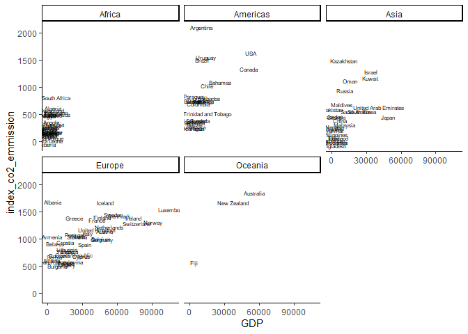

So, there is clearly a pretty strong correlation between the two, as
expected. Some exceptions are Argentina in the Americas and Kazakhstan
in Asia, who both have the highest CO2 emmissions index despite being on
the low end of the GDP scale. But there is no country with high GDP that
has an exceptionally low CO2 emmissions index, with Japan probably being
the best example. Let’s visualize life expectancy and CO2 emmissions
index next.

    ggplot(all_data, aes(x = life_expectancy, y = index_co2_emmission)) +
      geom_text(label = all_data$country, size = 2) +
      facet_wrap(. ~ continent)

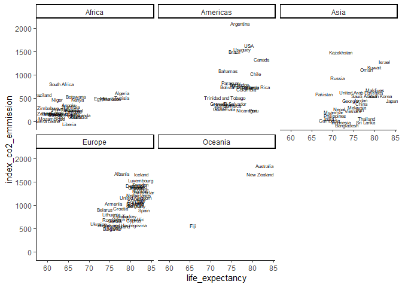

There still seems to be some correlation between these, but to a lesser
extend. The Americas, Asia and Europe are more blob-y. But that’s not a
very scientific term. Let’s actually caltulate the correlations between
GDP/life expectancy and CO2 emmissions index for each continent.

    GDP_correlation <- function(df){
      result <- cor.test(df$GDP, df$index_co2_emmission)$estimate[[1]]
      result
    }
    LE_correlation <- function(df){
      result <- cor.test(df$life_expectancy, df$index_co2_emmission)$estimate[[1]]
      result
    }

    correlations <- all_data %>%
      group_by(continent) %>%
      nest() %>%
      mutate(GDP_corr = map(data, GDP_correlation),
             LE_corr = map(data, LE_correlation))

    glimpse(correlations)

    ## Observations: 5
    ## Variables: 4
    ## Groups: continent [5]
    ## $ continent <chr> "Europe", "Africa", "Americas", "Oceania", "Asia"
    ## $ data      <list> [<tbl_df[37 x 9]>, <tbl_df[31 x 9]>, <tbl_df[24 x 9]>, <...
    ## $ GDP_corr  <list> [0.6493117, 0.7116719, 0.5667832, 0.9761408, 0.5162804]
    ## $ LE_corr   <list> [0.663573, 0.4280576, 0.32265, 0.9972214, 0.3256783]

We can see that all correlations are actually fairly strong, as high as
.99 for life expectancy in Oceania, which isn’t surprising since it only
has three data points. GDP tends to be correlated with CO2 emmissions
index more strongly than life expectancy, though the correlations are
similar for Europe and the GDP correlation is slightly less than the
life expectancy correlation.

### Step 3 - Answering the Question

And now, fun part \#2, can I use this data to see whether claims of a
longer and healthier life on a plant-based diet can be seen on a global
scale, when GDP/capita is controlled for? I have had a think about how
to go about doing this and I’ve decided on the following strategy:

1.  Fit a linear model with GDP and C02 emmissions index as predictors
    for life expectancy.
2.  Simulate lower C02 emmissions indexes and use the linear model
    coefficients to predict life expectancy under these simulations
3.  Simulate higher GDP and use the linear model coefficients to predict
    life expectancy under these simulations
4.  Compare changes in life expectancy between reality and simulations

First, the model fit:

    model <- lm(life_expectancy ~ GDP + index_co2_emmission, data = all_data)
    summary(model)

    ## 
    ## Call:
    ## lm(formula = life_expectancy ~ GDP + index_co2_emmission, data = all_data)
    ## 
    ## Residuals:
    ##      Min       1Q   Median       3Q      Max 
    ## -13.7556  -3.6440   0.8884   3.7036   9.2762 
    ## 
    ## Coefficients:
    ##                        Estimate  Std. Error t value             Pr(>|t|)    
    ## (Intercept)         68.84819568  0.77438411  88.907 < 0.0000000000000002 ***
    ## GDP                  0.00012649  0.00002921   4.330            0.0000315 ***
    ## index_co2_emmission  0.00512963  0.00124889   4.107            0.0000741 ***
    ## ---
    ## Signif. codes:  0 '***' 0.001 '**' 0.01 '*' 0.05 '.' 0.1 ' ' 1
    ## 
    ## Residual standard error: 4.877 on 118 degrees of freedom
    ## Multiple R-squared:  0.4899, Adjusted R-squared:  0.4812 
    ## F-statistic: 56.66 on 2 and 118 DF,  p-value: < 0.00000000000000022

This actually yields a better model then I expected, with an adjusted
R-squared of .48. Our model intercept is at 68.8 years and both of our
predictor coefficients are positive, meaning that higher GDP and C02
emmissions index are linked to higher life expectancy. Notice the
coefficient for C02 emmissions index is larger than the coefficient for
GDP, suggesting that, unfortunately, more emmissions = longer life.

#### C02 index - Simulation 1

Now, for a first simulation, I’ll change indices above 200, randomly
replacing them with an index based on a distribution with a mean of 0
and standard deviation of 200. These numbers are based on the current SD
of C02 emmissions index being 489.8401178, which I’ve decided to halve
so that no index is above 200. This is admittedly pretty arbitrary, I’ll
adjust for later simulations based on how this one turns out.

    #Simulation function
    simulate_index <- function(data, max_index, index_mean, index_sd){
      intact_subset <- filter(data, index_co2_emmission < max_index) #keep data with index lower than maximum
      simulation_subset <- filter(data, index_co2_emmission > max_index) #separate data with index higher than maximum
      simulated_indices <- rnorm(nrow(simulation_subset), mean = index_mean, sd = index_sd) #simulate indices
      intact_subset$simulated_indices <- intact_subset$index_co2_emmission #repeat existing column
      simulation_subset$simulated_indices <- simulated_indices #add simulated indices to column
      data <- rbind(intact_subset, simulation_subset) #combine
      data
    }

    simulation_0_200 <- simulate_index(all_data, 200, 0, 200)

Now we’ll make predictions about life expectancy using these simulated
C02 emmissions indices.

    #Assign model parameters
    intercept <- model$coefficients[[1]]
    slope_GDP <- model$coefficients[[2]]
    slope_index <- model$coefficients[[3]]

    all_data <- simulation_0_200 %>%
      mutate(predictions_1 = intercept + slope_GDP*GDP + slope_index*simulated_indices)

And visualize the change in life expectancy as a result of the
simulation at a glance, and then by plotting the real values in black
against the simulated ones in red.

    change <- all_data$life_expectancy - all_data$predictions_1
    plot(change) #real quick look: looks pretty normally distributed, change in life expectancy ranges from -10 years to +10 years

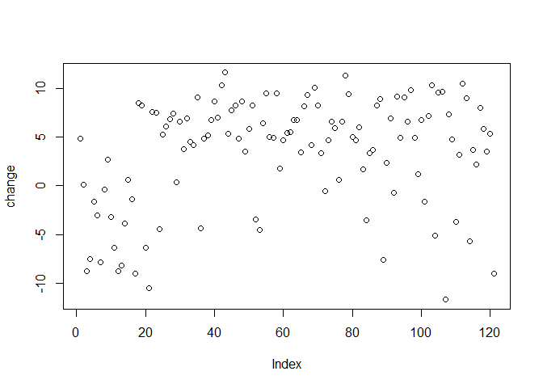

    ggplot(all_data, aes(x = life_expectancy, y = index_co2_emmission)) +
      geom_text(label = all_data$country, size = 2) +
      geom_text(aes(x = predictions_1, y = simulated_indices), label = all_data$country, size = 2, color = "Red") +
      facet_wrap(. ~ continent)

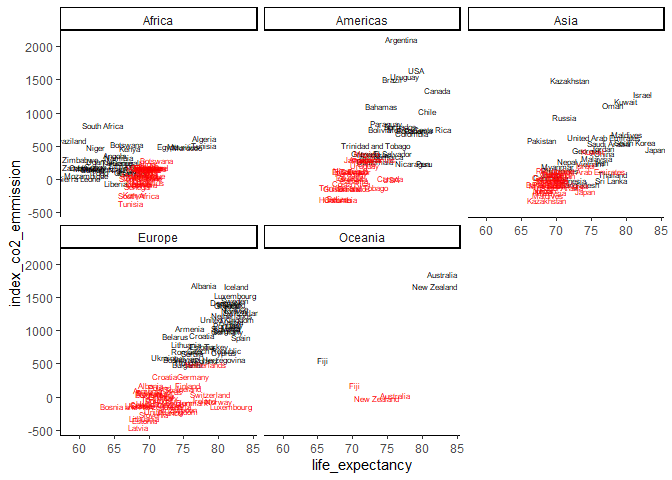

What does this tell us? Well, not much surprising, given how I chose to
simulate the emmissions index. Indices remained generally the same for
the African continent and life expectancy generally went up, though it
did decrease for some. The Americas, Asia and Europe mostly see a
decline in life expectancy, while in Oceania it’s a pretty great example
of regression towards the mean. For the next simulation, I’ll put the
mean at **-100** (yay plant-based!) and standard deviation at **400**,
closer to the actual variation present in our original data.

#### C02 index - Simulation 2

    #Simulate indices
    simulation_n100_400 <- simulate_index(all_data, 200, -100, 400)

    #Add predictions to data
    all_data <- simulation_n100_400 %>%
      mutate(predictions_2 = intercept + slope_GDP*GDP + slope_index*simulated_indices)

    all_data$simulated_indices <- simulation_n100_400$simulated_indices

    #Visualize change
    change <- all_data$life_expectancy - all_data$predictions_2
    plot(change)

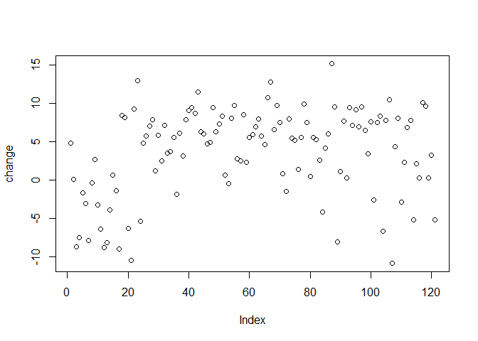

    ggplot(all_data, aes(x = life_expectancy, y = index_co2_emmission)) +
      geom_text(label = all_data$country, size = 2) +
      geom_text(aes(x = predictions_2, y = simulated_indices), label = all_data$country, size = 2, color = "Red") +
      facet_wrap(. ~ continent)

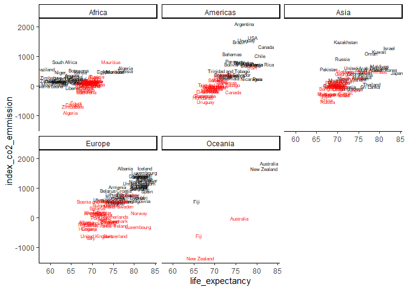

Once again, life expectancy generally falls, except in Africa. Next
let’s simulate higher GDP.

#### GDP - Simulation 1

For GDP, I’ll take the opposite approach and simulate an increased GDP,
so will select a cutoff where GDPs above will remain the same, and GDPs
below will be brought up. I’ll set the cutoff at 40000, the mean at
60000 and the standard deviation at 10000, based on eyeballing .

    #Simulation function
    simulate_gdp <- function(data, min_gdp, gdp_mean, gdp_sd){
      intact_subset <- filter(data, GDP > min_gdp) #keep data with GDP higher than minimum
      simulation_subset <- filter(data, GDP < min_gdp) #separate data with lower higher than minimum
      simulated_gdp <- rnorm(nrow(simulation_subset), mean = gdp_mean, sd = gdp_sd) #simulate indices
      intact_subset$simulated_gdp <- intact_subset$GDP #repeat existing column
      simulation_subset$simulated_gdp <- simulated_gdp #add simulated indices to column
      data <- rbind(intact_subset, simulation_subset) #combine
      data
    }

    #Simulate GDPs
    simulation_6_1 <- simulate_gdp(all_data, 40000, 60000, 10000)

    #Add predictions to data
    all_data <- simulation_6_1 %>%
      mutate(predictions_gdp1 = intercept + slope_GDP*simulated_gdp + slope_index*index_co2_emmission)

    all_data$simulated_gdp <- simulation_6_1$simulated_gdp

    #Visualize change
    change <- all_data$GDP - all_data$predictions_gdp1
    plot(change) #some changed by a bit, some by a lot

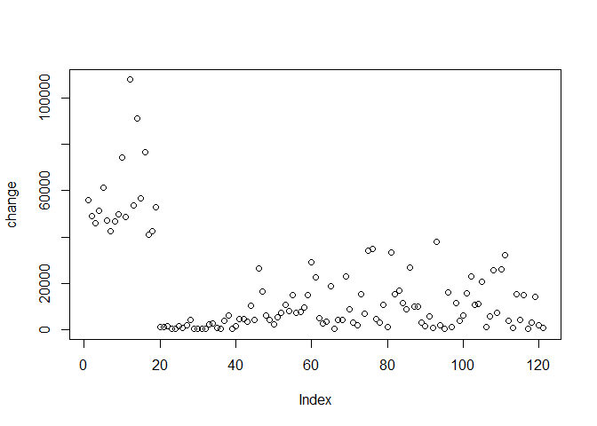

    ggplot(all_data, aes(x = life_expectancy, y = GDP)) +
      geom_text(label = all_data$country, size = 2) +
      geom_text(aes(x = predictions_gdp1, y = simulated_gdp), label = all_data$country, size = 2, color = "Red") +
      facet_wrap(. ~ continent)

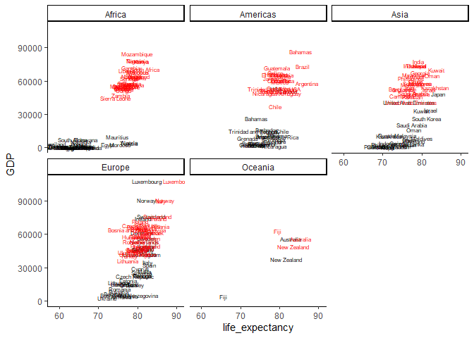

Clearly, GDP has a much better effect on life expectancy, where life
expectancay is higher pretty much across the board. That was a pretty
hefty increase in GDP though; let’s try something more modest for the
next simulation

#### GDP - Simulation 2

For this one, I’ll set the cutoff a little lower at 30000, the mean at
30000 and the standard deviation at 20000.

    #Simulate GDPs
    simulation_3_2 <- simulate_gdp(all_data, 30000, 30000, 20000)

    #Add predictions to data
    all_data <- simulation_3_2 %>%
      mutate(predictions_gdp2 = intercept + slope_GDP*simulated_gdp + slope_index*index_co2_emmission)

    all_data$simulated_gdp <- simulation_3_2$simulated_gdp

    #Visualize change
    change <- all_data$GDP - all_data$predictions_gdp2
    plot(change) #some changed by a bit, some by a lot

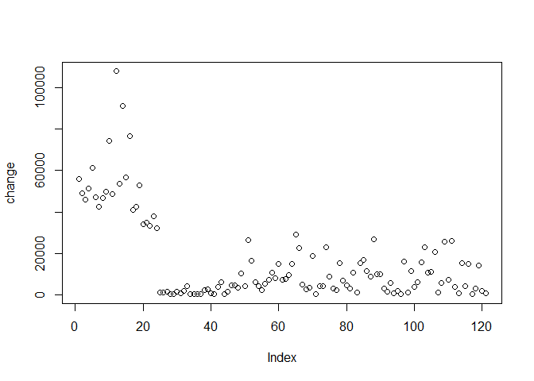

    ggplot(all_data, aes(x = life_expectancy, y = GDP)) +
      geom_text(label = all_data$country, size = 2) +
      geom_text(aes(x = predictions_gdp2, y = simulated_gdp), label = all_data$country, size = 2, color = "Red") +
      facet_wrap(. ~ continent)

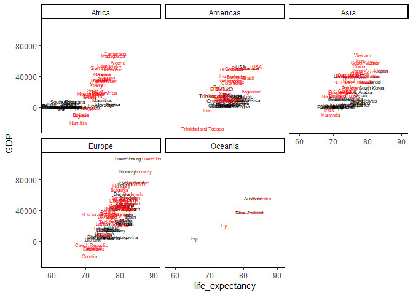

That’s a much more modest change, although we do have some negative GDP
values, which isn’t great. I’m sure it’s not too complicated, but I
don’t want to spend the time right now figuring out how to put one-sided
restrictions on `rnorm`’s limits - in this case, ensure values are above
say 200.

#### Combine simulations

Now, let’s see what it would look like if countries had higher GDP and
lower C02 emmissions indices… I’m going to use the values from both
second simulations.

    all_data <- all_data %>%
      mutate(predictions_combined = intercept + slope_GDP*simulated_gdp + slope_index*simulated_indices)

    #Visualize change
    ggplot(all_data, aes(x = life_expectancy, y = index_co2_emmission)) +
      geom_text(label = all_data$country, size = 2) +
      geom_text(aes(x = predictions_combined, y = simulated_indices), label = all_data$country, size = 2, color = "Red") +
      facet_wrap(. ~ continent)

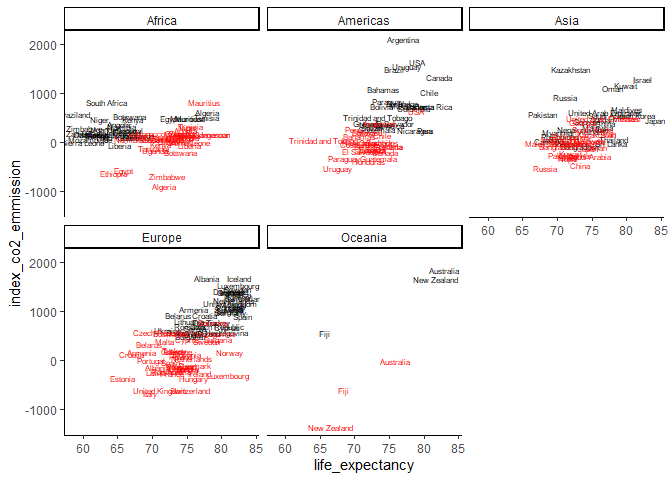

    ggplot(all_data, aes(x = life_expectancy, y = GDP)) +
      geom_text(label = all_data$country, size = 2) +
      geom_text(aes(x = predictions_combined, y = simulated_gdp), label = all_data$country, size = 2, color = "Red") +
      facet_wrap(. ~ continent)

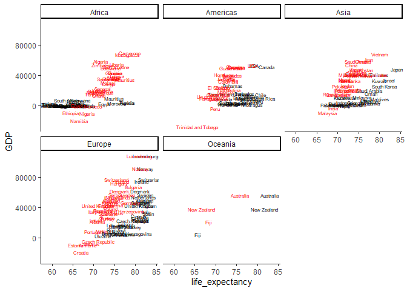

### Conclusion

Combining a higher GDP with a lower C02 emmissions index seems to
benefit most of the African continent, but has a negative effect on life
expectancy for most of the rest of the world. This suggests that
plant-based diets shorten life expectancy. However, I wouldn’t put too
much stock in this conclusion, given that these are pretty crude
simulations that only include two variables and that assume a causal
relationship between GDP/C02 emmissions index and life expectancy, where
the data can only demonstrate a correlation.

Still, this was a really interesting dataset for me to play with AND
some new things I did/learned were:

1.  plot text
2.  use simulations for analysis
3.  got data from web scraping

A few more quick ideas are to look at the life expectancy of countries
with high-GDP, low-C02 index and low-GDP, high-CO2 index:

    case_studies <- filter(all_data, country %in% c("Albania", "Argentina", "Japan", "Kazakhstan")) %>%
      select(country, index_co2_emmission, GDP, life_expectancy)

and it would be fun to make animated plots showing change in life
expectancy for each simulated increase in GDP of 10000 and every
decrease in C02 emmissions index of 100 (just number off the top of my
head)… a future project perhaps??
